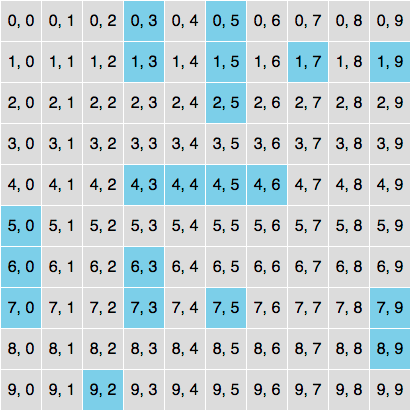

# Taskworld Battleship


## Install dependencies

```
yarn
```

## Run unit test
```
yarn test
```

## Run unit test with fsmonitor (optional)
```
fsmonitor -s -p '+*.js' yarn test
```
See [this issue](https://github.com/hapijs/lab/issues/73).

## Instruction

### 1. Make a request to "/" endpoint.

```
* Rebuilt URL to: localhost:8080/
*   Trying 127.0.0.1...
* Connected to localhost (127.0.0.1) port 8080 (#0)
> GET / HTTP/1.1
> Host: localhost:8080
> User-Agent: curl/7.49.0
> Accept: */*
>
< HTTP/1.1 200 OK
< content-type: text/html; charset=utf-8
< set-cookie: session=eyJpZCI6MTQ4MDc1ODE2MTc3MX0=; Domain=localhost; Path=/
< cache-control: no-cache
< content-length: 9
< vary: accept-encoding
< accept-ranges: bytes
< Date: Sat, 03 Dec 2016 09:42:42 GMT
< Connection: keep-alive
<
Game on!
```

### 2. Copy cookie to use in the "/attack" endpoint and use `position` query to fire at the desired location.

```
$ curl --cookie "session=eyJpZCI6MTQ4MDc1ODE2MTc3MX0=" localhost:8080/attack?position=1,2
```

### Gameplay example

Let's say the board looks like this.



```

# My first two moves are missed.
$ curl --cookie "session=eyJpZCI6MTQ4MDc1ODE2MTc3MX0=" localhost:8080/attack?position=1,2
Miss

$ curl --cookie "session=eyJpZCI6MTQ4MDc1ODE2MTc3MX0=" localhost:8080/attack?position=4,9
Miss

$ curl --cookie "session=eyJpZCI6MTQ4MDc1ODE2MTc3MX0=" localhost:8080/attack?position=0,3
Hit

$ curl --cookie "session=eyJpZCI6MTQ4MDc1ODE2MTc3MX0=" localhost:8080/attack?position=1,3
You just sank the Destroyer

$ curl --cookie "session=eyJpZCI6MTQ4MDc1ODE2MTc3MX0=" localhost:8080/attack?position=0,5
Hit
$ curl --cookie "session=eyJpZCI6MTQ4MDc1ODE2MTc3MX0=" localhost:8080/attack?position=1,5
Hit
$ curl --cookie "session=eyJpZCI6MTQ4MDc1ODE2MTc3MX0=" localhost:8080/attack?position=2,5
You just sank the Cruiser

$ curl --cookie "session=eyJpZCI6MTQ4MDc1ODE2MTc3MX0=" localhost:8080/attack?position=1,7
You just sank the Submarine

$ curl --cookie "session=eyJpZCI6MTQ4MDc1ODE2MTc3MX0=" localhost:8080/attack?position=1,9
You just sank the Submarine

$ curl --cookie "session=eyJpZCI6MTQ4MDc1ODE2MTc3MX0=" localhost:8080/attack?position=4,3
Hit
$ curl --cookie "session=eyJpZCI6MTQ4MDc1ODE2MTc3MX0=" localhost:8080/attack?position=4,4
Hit
$ curl --cookie "session=eyJpZCI6MTQ4MDc1ODE2MTc3MX0=" localhost:8080/attack?position=4,5
Hit
$ curl --cookie "session=eyJpZCI6MTQ4MDc1ODE2MTc3MX0=" localhost:8080/attack?position=4,6
You just sank the Battleship

$ curl --cookie "session=eyJpZCI6MTQ4MDc1ODE2MTc3MX0=" localhost:8080/attack?position=5,0
Hit
$ curl --cookie "session=eyJpZCI6MTQ4MDc1ODE2MTc3MX0=" localhost:8080/attack?position=6,0
Hit
$ curl --cookie "session=eyJpZCI6MTQ4MDc1ODE2MTc3MX0=" localhost:8080/attack?position=7,0
You just sank the Cruiser

$ curl --cookie "session=eyJpZCI6MTQ4MDc1ODE2MTc3MX0=" localhost:8080/attack?position=6,3
Hit
$ curl --cookie "session=eyJpZCI6MTQ4MDc1ODE2MTc3MX0=" localhost:8080/attack?position=7,3
You just sank the Destroyer

$ curl --cookie "session=eyJpZCI6MTQ4MDc1ODE2MTc3MX0=" localhost:8080/attack?position=7,5
You just sank the Submarine

$ curl --cookie "session=eyJpZCI6MTQ4MDc1ODE2MTc3MX0=" localhost:8080/attack?position=7,9
Hit
$ curl --cookie "session=eyJpZCI6MTQ4MDc1ODE2MTc3MX0=" localhost:8080/attack?position=8,9
You just sank the Destroyer

$ curl --cookie "session=eyJpZCI6MTQ4MDc1ODE2MTc3MX0=" localhost:8080/attack?position=9,2
You just sank the Submarine
Win! You completed the game in 22 moves

# Notice the missed shots are included.

```


## Development environment

- NodeJS v7.2.0
- MongoDB v3.4.0
